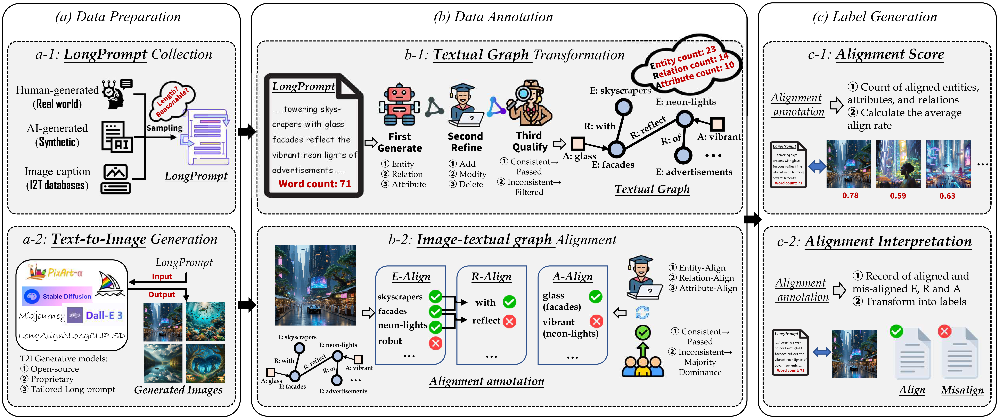

<div align="center">
    <a href="https://arxiv.org/pdf/%3CARXIV%20PAPER%20ID%3E"></a>
    <a href="https://welldky.github.io/LongT2IBench-Homepage/"></a>
    <!-- <a href="https://huggingface.co/spaces/orpheus0429/FGResQ"></a> -->
    <a href='https://github.com/yzc-ippl/LongT2IBench/stargazers'></a>

</div>

<h1 align="center">LongT2IBench: A Benchmark for Evaluating Long Text-to-Image Generation with Graph-structured Annotations</h1>

<div align="center">
    <a href="https://github.com/yzc-ippl/" target="_blank">Zhichao Yang</a><sup>1</sup>,
    <a href="https://github.com/welldky" target="_blank">Tianjiao Gu</a><sup>1</sup>,
    <a href="https://github.com/satan-7" target="_blank">Jianjie Wang</a><sup>1</sup>,
    <a href="https://github.com/satan-7" target="_blank">Jianjie Wang</a><sup>1</sup>,
    <a href="https://github.com/sxfly99" target="_blank">Xiangfei Sheng</a><sup>1</sup>,
    <a href="https://faculty.xidian.edu.cn/cpf/" target="_blank">Pengfei Chen</a><sup>1*</sup>,
    <a href="https://web.xidian.edu.cn/ldli/" target="_blank">Leida Li</a><sup>1,2*</sup>
</div>

<div align="center">
  <sup>1</sup>School of Artificial Intelligence, Xidian University
  <br>
  <sup>2</sup>State Key Laboratory of Electromechanical Integrated Manufacturing of High-Performance Electronic Equipments, Xidian University
</div>

<div align="center">
<sup>*</sup>Corresponding author
</div>

<div align="center">
  
</div>

<div style="font-family: sans-serif; margin-bottom: 2em;">
    <h2 style="border-bottom: 1px solid #eaecef; padding-bottom: 0.3em; margin-bottom: 1em;">News</h2>
    <ul style="list-style-type: none; padding-left: 0;">
        <li style="margin-bottom: 0.8em;">
            <strong>[2025-11-08]</strong> Our paper, "LongT2IBench: A Benchmark for Evaluating Long Text-to-Image Generation with Graph-structured Annotations", has been selected as an Oral presentation at AAAI 2026!
        </li>
        <li style="margin-bottom: 0.8em;">
            <strong>[2025-08-30]</strong> Code and pre-trained models for LongT2IBench released.
        </li>
    </ul>
</div>

## Quick Start

This guide will help you get started with the LongT2IBench inference code.

### 1. Installation

First, clone the repository and install the required dependencies.

```bash
git clone https://github.com/yzc-ippl/LongT2IBench.git
cd LongT2IBench
pip install -r requirements.txt
```

### 2. Download Pre-trained Weights and Dataset

##### Prepare Pre-trained Weights

You can download the pre-trained model weights from the following link: [**(Baidu Netdisk)**](https://pan.baidu.com/s/1Ltj77l31hyBkn6nLtYctnQ?pwd=i8ug)

Place the downloaded files in the `weights` directory.

- ``./weights/LongT2IBench-checkpoints``: The main model for generation and scoring.

Create the `weights` directory if it doesn't exist and place the files inside.

##### Prepare Datasets

You can download the dataset from the following link: [**(Baidu Netdisk)**](https://pan.baidu.com/s/1Ln0eIJABmBxzqa-bDm-DOw?pwd=j6p6)

Place the downloaded files in the `data` directory.

Create the `data` directory if it doesn't exist and place the files inside.

```
LongT2IBench/
|-- weights/
|   |-- LongT2IBench-checkpoints
|   |   |-- config.json
|   |   |-- ...
|-- data/
|   |-- imgs
|   |-- split
|   |   |-- train.json
|   |   |-- test.json
|   |   |-- val.json
|-- config.py
|-- dataset.py
|-- model.py
|-- requirements.txt
|-- README.md
|-- test_generation.py
|-- test_score.py
```

## 3. Run Inference

The `LongT2IBench` provides two main inference tasks: Long T2I Alignment Scoring and Long T2I Alignment Scoring.

##### Long T2I Alignment Scoring

```
python test_score.py
```

##### Long T2I Alignment Scoring

```
python test_generation.py
```

## Citation

If you find this work is useful, pleaes cite our paper!

```bibtex

```
